# Atlas CMMS — Schema del Database

> PostgreSQL, database `atlas`, ~72 entità/tabelle. Schema generato da Hibernate + Liquibase (naming **snake_case**;
> tabella utenti = **`own_user`**). Questo doc contiene: (1) come generare la **documentazione completa** dal DB
> reale (autorevole), (2) una **mappa ERD** delle relazioni principali, (3) query pronte per esplorare.

---

## 1. Generare la documentazione COMPLETA dal DB live (autorevole)

Sul server (`/srv/docker/atlas`). Vedi anche `dev-docs/backup-and-restore-guide.md`.

### 1a. Dump completo dello schema (tutte le tabelle, colonne, tipi, PK, FK, indici)
`PGPASSWORD` dal container → nessun prompt del DB. Semplice (un solo sudo, scrive nella tua home):
```bash
sudo docker exec atlas_db sh -c 'PGPASSWORD="$POSTGRES_PASSWORD" pg_dump --schema-only -U "$POSTGRES_USER" -d atlas' > ~/atlas_schema_$(date +%F).sql
```
(In `/srv/data/backups`: `sudo -v` prima, poi `sudo docker exec … | sudo tee …` — **senza `-t`**.)
Questo file `.sql` è la **fonte di verità**: contiene ogni `CREATE TABLE` con colonne, tipi, `PRIMARY KEY`,
`FOREIGN KEY`, `UNIQUE`, indici.

### 1b. Elenco tabelle + numero righe (panoramica)
```sql
SELECT relname AS table, n_live_tup AS rows
FROM pg_stat_user_tables ORDER BY relname;
```

### 1c. Tutte le colonne di tutte le tabelle
```sql
SELECT table_name, column_name, data_type, is_nullable, column_default
FROM information_schema.columns
WHERE table_schema = 'public'
ORDER BY table_name, ordinal_position;
```

### 1d. Tutte le chiavi esterne (la "mappa" testuale: figlio → padre)
```sql
SELECT tc.table_name        AS child_table,
       kcu.column_name      AS fk_column,
       ccu.table_name       AS parent_table,
       ccu.column_name      AS parent_column,
       tc.constraint_name
FROM information_schema.table_constraints tc
JOIN information_schema.key_column_usage kcu
     ON tc.constraint_name = kcu.constraint_name AND tc.table_schema = kcu.table_schema
JOIN information_schema.constraint_column_usage ccu
     ON ccu.constraint_name = tc.constraint_name AND ccu.table_schema = tc.table_schema
WHERE tc.constraint_type = 'FOREIGN KEY' AND tc.table_schema = 'public'
ORDER BY child_table, fk_column;
```
> Incollami l'output di **1d** e ti genero la mappa ERD **completa** (tutte le 72 tabelle) come diagramma/artifact.

### In psql: comandi rapidi
- `\dt` elenca le tabelle · `\d nome_tabella` struttura + FK di una tabella · `\di` indici · `\x` output verticale.

---

## 2. Mappa ERD — relazioni principali (dominio core)

> Diagramma delle tabelle più importanti e dei loro collegamenti (chiavi esterne). Le tabelle di supporto
> (config, envers/audit `*_aud`, workflow, custom field, ecc.) sono omesse per leggibilità — ci sono tutte nel dump §1a.
> Legenda: `||--o{` = uno-a-molti (il lato `||` è il "padre" referenziato dalla FK).

```mermaid
erDiagram
    COMPANY ||--o{ OWN_USER : "company_id"
    COMPANY ||--o{ ROLE : "company_id"
    COMPANY ||--o{ ASSET : "company_id"
    COMPANY ||--o{ LOCATION : "company_id"
    COMPANY ||--o{ WORK_ORDER : "company_id"
    COMPANY ||--o{ PART : "company_id"
    COMPANY ||--o{ METER : "company_id"
    COMPANY ||--o{ TEAM : "company_id"
    COMPANY ||--o{ REQUEST : "company_id"
    COMPANY ||--o{ PURCHASE_ORDER : "company_id"
    COMPANY ||--|| SUBSCRIPTION : "subscription_id"
    SUBSCRIPTION_PLAN ||--o{ SUBSCRIPTION : "subscription_plan_id"

    ROLE ||--o{ OWN_USER : "role_id"
    USER_SETTINGS ||--|| OWN_USER : "user_settings_id"
    LOCATION ||--o{ OWN_USER : "location_id"
    OWN_USER ||--o{ SUPER_ACCOUNT_RELATION : "super_user_id / child_user_id"

    LOCATION ||--o{ LOCATION : "parent_location_id"
    LOCATION ||--o{ ASSET : "location_id"
    ASSET ||--o{ ASSET : "parent_asset_id"
    ASSET_CATEGORY ||--o{ ASSET : "category_id"
    OWN_USER ||--o{ ASSET : "primary_user_id"

    ASSET ||--o{ WORK_ORDER : "asset_id"
    LOCATION ||--o{ WORK_ORDER : "location_id"
    TEAM ||--o{ WORK_ORDER : "team_id"
    OWN_USER ||--o{ WORK_ORDER : "primary_user_id / completed_by_id"
    WORK_ORDER_CATEGORY ||--o{ WORK_ORDER : "category_id"
    WORK_ORDER ||--o{ REQUEST : "work_order_id"

    WORK_ORDER ||--o{ LABOR : "work_order_id"
    WORK_ORDER ||--o{ ADDITIONAL_COST : "work_order_id"
    WORK_ORDER ||--o{ PART_QUANTITY : "work_order_id"
    WORK_ORDER ||--o{ COMMENT : "work_order_id"
    WORK_ORDER ||--o{ WORK_ORDER_HISTORY : "work_order_id"
    OWN_USER ||--o{ LABOR : "assigned_to_id"

    PART_CATEGORY ||--o{ PART : "category_id"
    PART ||--o{ PART_QUANTITY : "part_id"
    PART ||--o{ PART_TRANSACTION : "part_id"

    METER_CATEGORY ||--o{ METER : "meter_category_id"
    LOCATION ||--o{ METER : "location_id"
    METER ||--o{ READING : "meter_id"

    VENDOR ||--o{ PURCHASE_ORDER : "vendor_id"

    OWN_USER ||--o{ NOTIFICATION : "user_id"
    OWN_USER ||--o{ REFRESH_TOKEN : "user_id"
    OWN_USER ||--o{ VERIFICATION_TOKEN : "user_id"
    OWN_USER ||--o{ API_KEY : "user_id"

    OWN_USER ||--o{ WORK_ORDER_ASSIGNED_TO : "M:N work order"
    OWN_USER ||--o{ T_TEAM_USER_ASSOCIATIONS : "M:N team"
    OWN_USER ||--o{ T_ASSET_USER_ASSOCIATIONS : "M:N asset"
    OWN_USER ||--o{ T_LOCATION_USER_ASSOCIATIONS : "M:N location"
```



---

## 3. Tabelle raggruppate per dominio (le 72)

- **Utenti / Auth / Multi-tenant:** `own_user`, `user_settings`, `role`, `company`, `company_settings`,
  `general_preferences`, `ui_configuration`, `super_account_relation`, `user_invitation`, `refresh_token`,
  `verification_token`, `api_key`, `push_notification_token`, `user_app_stats`, `shift_configuration`,
  `shift_configuration_exceptions`, `notification`.
- **Asset & Location:** `asset`, `asset_category`, `asset_downtime`, `deprecation`, `location`, `floor_plan`, `file`.
- **Work Order / Request:** `work_order`, `work_order_category`, `work_order_history`, `work_order_meter_trigger`,
  `request`, `request_portal`, `request_portal_field`, `labor`, `additional_cost`, `comment`, `relation`,
  `work_order_configuration`, `work_order_request_configuration`, `checklist`, `task`, `task_base`, `task_option`.
- **Preventive Maintenance / Schedule:** `preventive_maintenance`, `schedule`.
- **Parti / Magazzino / Acquisti:** `part`, `part_category`, `part_quantity`, `part_transaction`, `multi_parts`,
  `purchase_order`, `purchase_order_category`, `vendor`, `customer`, `currency`.
- **Meter:** `meter`, `meter_category`, `reading`.
- **Team:** `team`.
- **Costi / Categorie:** `cost_category`, `time_category`, `field_configuration`.
- **Custom fields / Sequenze:** `custom_field`, `custom_field_value`, `custom_sequence`.
- **Workflow:** `workflow`, `workflow_action`, `workflow_condition`.
- **Licensing / Billing:** `subscription`, `subscription_plan`, `keygen_request_tracker`.
- **Audit (Hibernate Envers):** tabelle `*_aud` + `revinfo` (storico revisioni).
- **Liquibase (interne):** `databasechangelog`, `databasechangeloglock`.
- **Join M:N (`t_*` / `*_associations`):** `t_team_user_associations`, `t_part_user_associations`,
  `t_asset_user_associations`, `t_location_user_associations`, `t_meter_user_associations`, `work_order_assigned_to`,
  `own_user_work_orders`, `own_user_preventive_maintenances`, `preventive_maintenance_assigned_to`,
  `work_order_meter_trigger_assigned_to`, `request_assigned_to`, ecc.

> L'elenco esatto e aggiornato: query §1b (`\dt`).

---

## 4. Note
- **Naming:** camelCase Java → snake_case DB (`emailNotified` → `email_notified`). Entità → tabella snake_case, salvo
  `@Table` espliciti (`User`→`own_user`, `ShiftConfiguration`→`shift_configuration`, `WorkOrderAud`→`work_order_aud`).
- **Modifiche schema:** solo via **changeset Liquibase** (`api/.../db/changelog/`), **mai** `ALTER` a mano (il backend
  gira con `ddl-auto: validate`).
- **Mappa completa:** per l'ERD con **tutte** le 72 tabelle, esegui la query §1d e incollami l'output → la genero.
